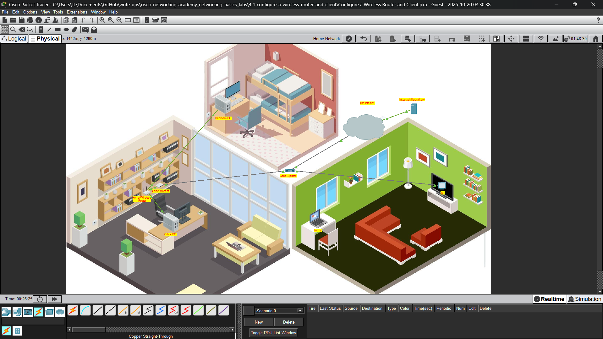
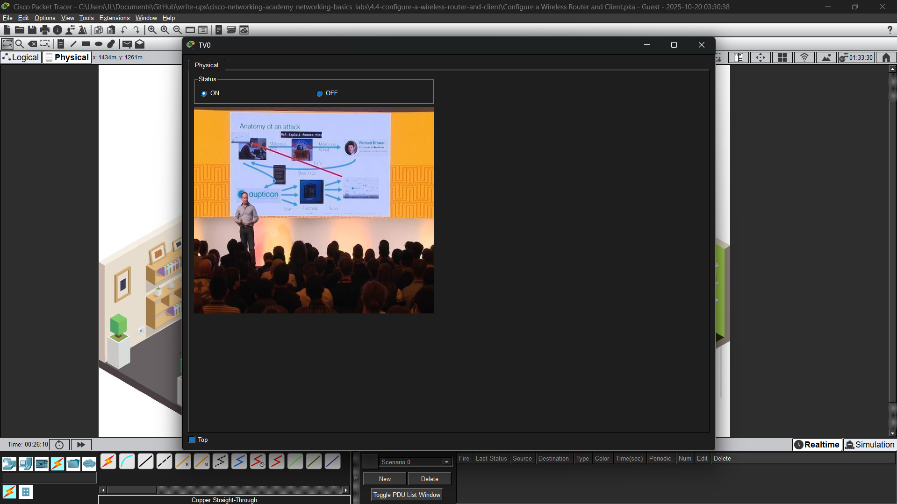

# Configure a Wireless Router and Client
**Course:** Cisco Networking Academy: Networking Basics 
**Name:** John Lamuel Buendicho 
**Date:** 25-10-20 

---
## 1. Introduction
This project focuses on the configuration of wireless routers and clients; establishing connection between these devices; and testing connectivity; all within a simulated environment inside Cisco Packet Tracer.

---
## 2. Objectives
- Connect the Devices
- Configure the Wireless Router
- Configure IP Addressing and Test Connectivity

---
## 3. Tools & Technologies
- Cisco Packet Tracer

---
## 4. Methodology
-  Part 1: Connect the devices
    > In this activity we are connecting to the internet via a cable company, which delivers internet and video services via coaxial cable. With this in mind, we will start by connecting all end devices connected via coaxial cable (e.g. modems, TVs, etc.)

    - Step 1: Connect coaxial cables
        - Cable Splitter coax1 -> Cable Modem port0

        - Cable Splitter coax2 -> TV port0
            > To test connectivity between tv and splitter, turn on the tv. Connectivity is confirmed if an image pops up in the tv

        >Notice that there are still devices not connected, this is because not all end devices have coaxial port. Tipically, there will be a Router that connects to the modem via straight-through cables to establish connection to the end devices via WLAN or LAN.

    - Step 2: Connect Network Cables
        - Cable Modem port0 -> Home Wireless Router internet

        >the PCs in this scenario don't have WLAN adapters, so we connect them to the router via straight-through cable.

        - Office PC fe0 -> Home Wireless Router ge1

        - Bedroom PC fe0 -> Home Wireless Router ge2

- Part 2: Configure the Wireless Router
    - Step 1: Access the router GUI
        >The router GUI can be accessed by any device connected to the router (here we used the office PC)

        - go to Desktop tab > IP Configuration

        - enable DHCP, take note of the default gateway address (Router's IP)

        - close the IP Config window and open the web browser, then in the URL box enter the Router's IP

        - login as admin with admin as username and password
            >Username: admin 
            Passphrase: admin 
            are the admin credentials for devices in Cisco Packet Tracer

    - Step 2: Configure basic settings
        - Set max users via Set up tab > Network setup area > Maximum Number of users

        - Set admin password in the Administration tab

    - Step 3: Configure a wireless LAN
        - go to Wireless tab

        - enable 2.4GHz network

        - change SSID

        - Set security mode to WPA2 Personal and set the Wi-Fi password

- Part 3: Configure IP addressing and Test Connectivity
    - Step 1: Connect laptop to wireless network
        - go to Desktop tab > PC Wireless

        - in the Connect Tab, connect to the wireless router, then click the Link Information Tab to verify connection

        - in the Link Information tab click more info to see that the Laptop's IP is now 192.168.0.x verifying that DHCP is working

    - Step 2: Test Connectivity
        - via the connected devices go to web browser and visit https://skillsforall.srv (webserver connected on the other side of the internet) to verify that the devices are connected

---
## 5. Output
- Devices Wired:

- TV Output:

- skillsforall Page

---
## 6. Discussion
In this activity I have observed that the internet is just computers and networks interconnected with each other. I have also observed how ISPs connect LANs to the internet

---
## 7. Conclusion
In this activity I learned about how end devices are connected via the appropriate cables and wires, how to configure devices to automatically recieve their IP addresses via DHCP, how to configure a wireless router via the GUI configuration, and how to verify that these devices have connectivity with each other

---

## 8. References
Cisco Networking Academy: Networking Basics, 4.4.4 Packet Tracer - Configure a Wireless Router and Client
---