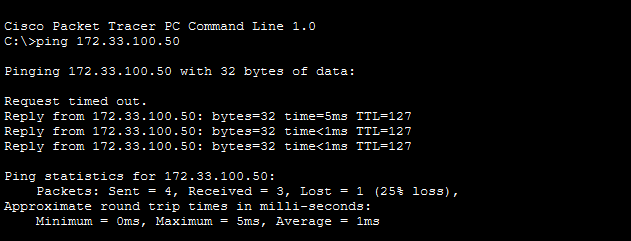
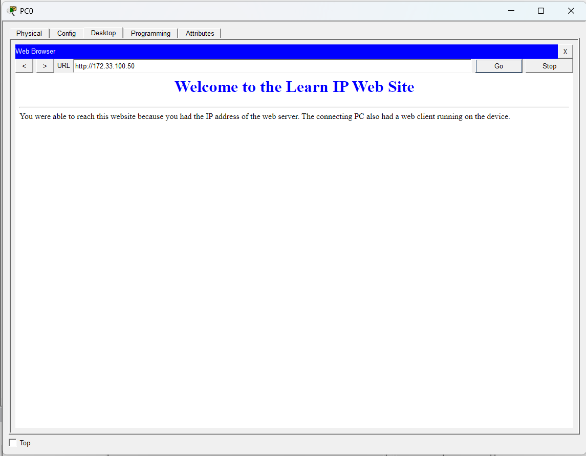

# Connect to a Web Setver
**Course:** Cisco Networking Academy: Networking Basics<br>
**Name:** John Lamuel Buendicho<br>
**Date:** 07-11-20<br>

---
## 1. Introduction
This project focuses on how packets are sent across the internet via IP addresses

---
## 2. Objectives
- Verify connection to the web server via ping
- Connect to the web server via the web browser

---
## 3. Tools & Technologies
- Cisco Packet Tracer

---
## 4. Methodology
- Part 1: Verifying connection via ping
    > in this activity it is instructed that we verify connection via ping. Ping is a network utility, available in the terminal, that measures the time it takes for a small data packet to travel from your device to a server and back, also known as round-trip time or latency

    - Step 1: open cmd

    - Step 2: verify connection via ping
        - use the ```ping``` command to verify connection
            ```
            ping <ip-address>
            ```
            in this scenario, the ip address of the web server is 172.33.100.50, so we ping it by running:
            ```
            ping 172.33.100.50
            ```
    
    - Step 3: analyze the output of ping
        - if connection is successful, the server would give a reply and ping would show something like this:
            ```
            Reply from 172.33.100.50: bytes=32 time=5ms TTL=127
            Reply from 172.33.100.50: bytes=32 time<1ms TTL=127
            Reply from 172.33.100.50: bytes=32 time<1ms TTL=127
            ```
            > this verifies connection with the web server

- Part 2: connect via the web browser
    - Step 1: open web browser
    
    - Step 2: connect to the web server
        - connect to the web server by using its ip address as the url
            ```
                http://<ip-address>
            ```
            ```
                http://172.33.100.50
            ```
            > successful connection to the web server would return its contents


---
## 5. Output
- Ping Output:

- Web Browser Output:


---
## 6. Discussion
In this activity I have observed that ip addresses is how devices on the internet find each other, we can use ip addresses with the ping command to verify connection with each other, and we can use the web browser to connect to a web server by using its ip address as the url

---
## 7. Conclusion
In this activity I learned how ip addresses are used to send packets across the internet; how we can use ping to send packets and verify connection via the reply; and how we can access web servers by using its ip address in the web browser

---

## 8. References
Cisco Networking Academy: Networking Basics, 8.1.3 Packet Tracer - Connect to a Web Setver
---